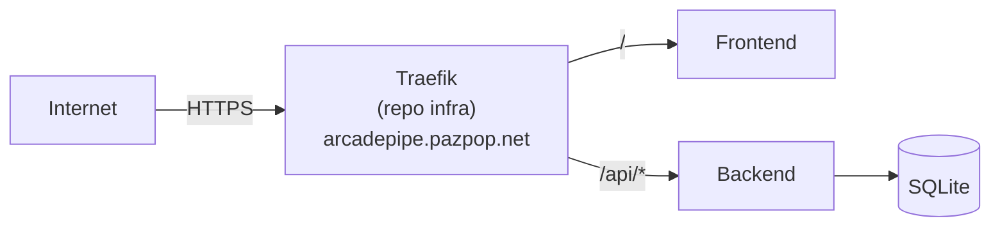

# ArcadePipe 🚀

Mini jeu vidéo (*The Last Starfighter*) avec leaderboard, déployé sur un VPS Hetzner via Docker. Projet d'apprentissage DevOps/IaC — conçu par [pazpop](https://github.com/pazpop) avec [Claude](https://claude.com).

Ce repo ne contient que l'app (backend + frontend). L'infra (VPS, OpenTofu) et le reverse-proxy partagé (Traefik, mutualisé entre jeux) vivent dans le repo séparé [`terraform-infra-pazpop-hetzner`](https://github.com/pazpop/terraform-infra-pazpop-hetzner) — doit tourner en premier sur la VPS avant ce compose (réseau Docker externe `traefik-public`).


## 🎓 Pourquoi ce projet ?

Ce projet (et l'infra qui l'héberge, voir [`terraform-infra-pazpop-hetzner`](https://github.com/pazpop/terraform-infra-pazpop-hetzner)) est réalisé avec l'aide de [Claude](https://claude.com) (Anthropic) comme assistant technique. L'objectif n'est pas de contourner l'apprentissage, mais de l'accélérer : explorer des choix que je n'aurais pas eu le temps de creuser seul, challenger mes propres habitudes, et accélérer les tâches répétitives. Je reste le décideur à chaque étape — je teste avant de faire confiance, je demande des revues de sécurité et de qualité, et j'écarte ce qui est disproportionné pour un projet de cette taille (voir *Sécurité* et *Roadmap* ci-dessous, qui documentent aussi bien ce qui est fait que ce qui est volontairement laissé de côté, et pourquoi). L'IA ne remplace pas l'expertise, elle en démultiplie la portée.

## Stack

| Composant | Techno | Rôle |
|---|---|---|
| Reverse proxy | [Traefik](https://traefik.io/) *(repo infra séparé)* | Seul point d'entrée public (80/443) pour tous les jeux du VPS — route vers ce jeu par nom d'hôte (`arcadepipe.pazpop.net` → frontend, `/api/*` → backend), via labels Docker |
| Backend | FastAPI + `sqlite3` natif | API du leaderboard, sans port publié |
| Frontend | JS vanilla (modules ES6) + Canvas 2D | Shoot'em up à défilement horizontal, pixel art généré par code, sans port publié |
| DB | SQLite (WAL), volume Docker | Scores |
| Musique | [libopenmpt](https://lib.openmpt.org/libopenmpt/) via [chiptune3.js](https://github.com/DrSnuggles/chiptune) (`AudioWorklet`) | Rejoue le vrai fichier `.xm` (`frontend/music/theme.xm`), pas une recomposition |



**https://arcadepipe.pazpop.net** — TLS automatique (Let's Encrypt) via Traefik, renouvellement géré tout seul. `game.pazpop.net` héberge le portail listant tous les jeux du VPS (voir repo infra, `portal/`) — ArcadePipe y apparaît automatiquement via ses labels Docker, aucun lien à ajouter à la main.

## Lancer en local

```bash
cd backend && python -m venv venv && source venv/bin/activate  # Windows: venv\Scripts\activate
pip install -r requirements.txt && python seed.py && uvicorn main:app --reload
```
```bash
cd frontend && python -m http.server 5500   # http://localhost:5500
```

## Docker (front + back, derrière Traefik)

Nécessite le réseau externe `traefik-public` (créé par le stack Traefik du repo infra — voir son README) :

```bash
docker network create traefik-public   # si pas déjà fait par le stack Traefik
docker compose up --build
```

Sans Traefik qui tourne à côté, backend/frontend n'ont pas de port publié (par design) — pour un test isolé rapide sans proxy, ajouter temporairement un `ports:` ou utiliser le mode "Lancer en local" ci-dessus.

## Déploiement autonome (sans Traefik ni l'infra pazpop)

Pour faire tourner ArcadePipe ailleurs, sans dépendre de Traefik ni du repo infra pazpop : `docker-compose.standalone.yml`, à la racine, publie directement le port 80 et garde toutes les protections déjà en place (non-root, rootfs read-only, `cap_drop: ALL`, rate limiting, CORS) — seul le routage change, Caddy (frontend) route lui-même `/api/*` vers le backend (voir la route ajoutée dans `frontend/Caddyfile`), pas besoin d'un reverse-proxy externe.

```bash
docker compose -f docker-compose.standalone.yml up --build -d
# -> http://localhost
```

Testé de bout en bout (page d'accueil, fichiers statiques, `GET`/`POST /api/scores` via le routage interne, non-root confirmé) avant d'être documenté ici. Port 80 déjà pris ? Changer le mapping `"80:80"` du service `frontend` (ex: `"8080:80"`) et adapter `ALLOWED_ORIGINS` du service `backend` à l'URL réellement utilisée.

`docker-compose.yml` (à la racine) reste le déploiement de référence pour l'infra pazpop — les deux fichiers coexistent, choisir celui qui correspond à l'usage.

## Tests

Backend — logique pure (`test_main.py` : validation des scores, `get_client_ip`) + intégration HTTP (`test_api.py` : vraies routes FastAPI via `TestClient`, DB SQLite temporaire par test) :

```bash
cd backend && pip install -r requirements-dev.txt && pytest   # 25 tests
```
```bash
cd frontend/js && node --test   # 9 tests, aucune dépendance npm (Node ≥ 18)
```

Lint backend (voir `backend/pyproject.toml`, vérifié en CI avant chaque build — voir CI/CD) :

```bash
cd backend && ruff check .   # inclus dans requirements-dev.txt ci-dessus
```

### Tests bout-en-bout (Playwright)

`backend`/`frontend/js` ci-dessus couvrent la logique pure, mais rien du canvas, de la souris/du tactile ni de l'audio — c'est ce que `e2e/` teste, en pilotant un vrai navigateur (Chromium) sur le jeu tel qu'un joueur le vivrait.

> **C'est quoi, "bout-en-bout" (e2e) ?** Un petit robot qui joue au jeu à ta place : il ouvre un vrai navigateur, bouge la souris, clique, attend, prend des captures d'écran — exactement ce qu'on ferait à la main pour vérifier qu'un changement n'a rien cassé, mais écrit une fois et rejouable en une commande (`npm test`) au lieu de tout refaire manuellement à chaque modification. Il ne juge pas si un écran est "joli" (ça reste à l'œil humain via les captures dans `e2e/test-results/`) — il attrape surtout les vraies casses : une erreur JS, un bouton qui ne répond plus, un écran qui reste figé.

```bash
cd e2e
npm install
npm run install-browsers   # télécharge Chromium pour Playwright (une fois)
npm test                   # ou : npx playwright test --headed pour voir le navigateur
```

`npm test` démarre et arrête automatiquement le serveur statique du frontend (port 5500, même commande que "Lancer en local" plus haut) — pas besoin de le lancer à la main. Les résultats (dont un rapport HTML en cas d'échec) et les captures d'écran atterrissent dans `e2e/test-results/` (ignoré par git).

**Ce qui est couvert** (voir `e2e/tests/`) :
- `menu-pause.spec.js` — chargement du menu, clic souris dans la pause, confirmation de sortie de partie, aide de bienvenue (première partie), accès à l'aide depuis le menu/la pause/le bouton du panneau
- `gameplay.spec.js` — tir manuel vs tir auto (+ persistance), sélection aléatoire de piste musicale, session de jeu prolongée (vague 1 → 2), saisie du nom (nom aléatoire pré-rempli + validation tactile, sans clavier)
- `powerups-boss.spec.js` — ramassage de bonus (un seul à la fois), bouclier (absorption de coups), premier combat de boss

**Limite volontaire** : le rendu canvas n'est pas inspectable comme du DOM, donc pas d'assertion pixel-exacte possible. Ces tests valident surtout l'absence d'erreurs JS sur de vraies séquences d'interaction, avec des captures d'écran pour la vérification visuelle humaine — pas un remplacement total du "lancer le jeu et regarder", plutôt un filet qui attrape les régressions qui plantent (erreurs JS, écran figé, flux cassé).

**Forcer une constante le temps d'un test** (taux de drop d'un bonus, difficulté d'une vague...) sans toucher au code source ni exposer de point d'accès de debug en production : les modules ES sont mis en cache par URL par le navigateur, donc un import dynamique déclenché depuis le test récupère les *mêmes* objets déjà utilisés par la partie en cours, pas une copie isolée :

```js
await page.evaluate(async () => {
  const { DIFFICULTY } = await import("/js/config.js");
  DIFFICULTY.baseWaveKills = 1; // vague suivante en 1 kill au lieu de 10
});
```

Ça marche pour n'importe quel module déjà chargé par la page — `config.js` pour les constantes, ou `main.js` pour atteindre les instances `music`/`audio` (voir l'export en bas de `frontend/js/main.js`). Voir `e2e/tests/helpers.js` pour le détail et d'autres exemples.

## VPS

Déploiement manuel (CI/CD disponible mais pas encore exercé par un vrai push — voir Roadmap) :

```bash
./deploy.sh          # IP par défaut (91.99.16.66)
./deploy.sh <IP>      # ou une autre IP
```

Construit les images sur le serveur, redémarre les conteneurs, vérifie `/api/health` et la page d'accueil. Suppose que la stack Traefik (repo infra) tourne déjà.

Détail de ce que fait le script (tar/scp/ssh), si besoin de le reproduire à la main :

```bash
tar -czf - -C . --exclude='.git' --exclude='backend/venv' --exclude='backend/__pycache__' \
  --exclude='backend/arcadepipe.db' \
  backend frontend docker-compose.yml \
  | ssh -i ~/.ssh/arcadepipe_vps root@<IP> "mkdir -p ~/arcadepipe && tar xzf - -C ~/arcadepipe"
ssh -i ~/.ssh/arcadepipe_vps root@<IP> "cd ~/arcadepipe && docker compose up --build -d"
```

(Suppose que le stack Traefik du repo infra tourne déjà sur la VPS, réseau `traefik-public` créé.)

## Sécurité

- En-têtes de sécurité HTTP (HSTS, `X-Content-Type-Options`, `X-Frame-Options`, `Referrer-Policy`, `Permissions-Policy`) posés par le middleware Traefik partagé (`secure-headers`, repo infra), en-tête `Server` retiré
- CORS restreint (`ALLOWED_ORIGINS`, jamais `"*"`), requêtes SQL paramétrées, entrées validées (Pydantic)
- Nom de joueur jamais inséré dans du HTML (rendu Canvas côté client, API JSON côté serveur) — aucune surface XSS, sans échappement explicite à maintenir
- **Rate limiting** (`slowapi`, par IP réelle via `X-Forwarded-For`, fiable car le backend n'est joignable que par Traefik) : `POST /api/scores` à 5/minute, `GET /api/scores` à 60/minute (lecture bon marché mais toujours limitée, en défense en profondeur)
- Backend non-root, rootfs read-only, `cap_drop: ALL` (frontend : voir Roadmap)
- Firewall (repo infra) : SSH restreint à l'IP de pazpop, 80/443 ouverts (jeu public), backend/frontend sans port exposé (seul Traefik l'est)
- Secrets (token Hetzner) jamais commités — vivent dans le repo infra, jamais ici
- **Non fait volontairement** : score non authentifié (triche possible via `curl`, juste borné à 999999)

## Données collectées

- **Pseudo, score, vague** (`player_name` 1-20 caractères, `score`, `wave`) : seules données stockées, dans SQLite, sans limite de rétention.
- **Adresse IP** : lue depuis `X-Forwarded-For` uniquement pour le rate limiting (`slowapi`) — gardée en mémoire le temps de la fenêtre de 5/minute, jamais écrite en base ni dans un fichier de log applicatif.
- Aucun cookie, aucun tracker, aucun outil d'analytics.

## CI/CD

`.github/workflows/deploy.yml` : sur push vers `main`, build + push des images vers GHCR (tags `:latest` et `:<sha>`, public — pas d'auth nécessaire sur la VPS pour `docker pull`), synchronisation de `docker-compose.yml` sur la VPS, puis déploiement SSH (`docker compose pull && up -d`).

Secrets GitHub à configurer une fois le repo créé : `DEPLOY_HOST`, `DEPLOY_USER`, `DEPLOY_SSH_KEY`.

⚠️ GHCR crée les packages en **privé** par défaut au premier push — après le premier run, aller dans Package Settings sur GitHub et les passer en public (sinon `docker compose pull` échoue sur la VPS sans authentification).

## Roadmap

- [ ] Créer les repos GitHub (`arcadepipe`, `terraform-infra-pazpop-hetzner`) et pousser le code
- [ ] Premier push vers `main` pour valider le pipeline CI/CD de bout en bout (`.github/workflows/deploy.yml` n'a encore jamais tourné — déploiements actuels faits à la main), puis passer les packages GHCR en public (voir ci-dessus)
- [ ] Sauvegardes DB ([Litestream](https://litestream.io/) ou cron) — **reporté volontairement** : pas de vraie perte critique en cas d'incident pour un classement de jeu perso, pas prioritaire pour l'instant
- [ ] Score authentifié (jeton signé émis au début de la partie, exigé à la soumission) — pas urgent, le score non authentifié est un risque assumé (voir Sécurité)

## Structure

```
arcadepipe/
├── backend/    # FastAPI + SQLite + Dockerfile
├── frontend/   # Dockerfile (Caddy = serveur de fichiers statiques interne, sans rapport avec Traefik)
│   ├── index.html, css/style.css
│   ├── js/       # config, assets (sprites générés), moteur de jeu (modules ES6)
│   │   └── audio/  # sfx.js (synthèse), music.js + leaderboard.js (intégrations)
│   ├── lib/      # chiptune3.js + libopenmpt.worklet.js (lecture de module tracker, AudioWorklet)
│   └── music/    # playlist de .xm — voir Crédits
├── e2e/        # tests bout-en-bout Playwright — voir section Tests
├── .github/workflows/  # CI/CD (lint + build + push GHCR + déploiement SSH)
├── docker-compose.yml             # infra pazpop (Traefik)
└── docker-compose.standalone.yml  # déploiement autonome (voir section dédiée)
```

## Crédits

- Musique : playlist de 5 morceaux composés pour la scène keygen par **DEViANCE** et **h4x0r** — trouvés via [keygen.music](https://keygen.music/) / [keygenmusic.tk](https://keygenmusic.tk/). Merci à ses autrices/auteurs et à la scène tracker en général. Aucune licence explicite trouvée (les dépôts qui les archivent n'en ont pas non plus) : utilisés ici sciemment pour un projet personnel non-commercial, pas au-delà.
- Lecture du fichier : [libopenmpt](https://lib.openmpt.org/libopenmpt/) (BSD-3-Clause) via [chiptune3.js](https://github.com/DrSnuggles/chiptune) (MIT) — la même techno que keygenmusic.tk utilise pour son propre lecteur.

## Licence

Code sous [MIT](LICENSE). La musique (`frontend/music/`) n'est pas couverte par cette licence — voir Crédits ci-dessus pour son statut.
