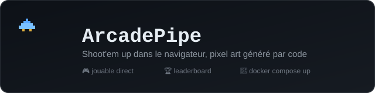
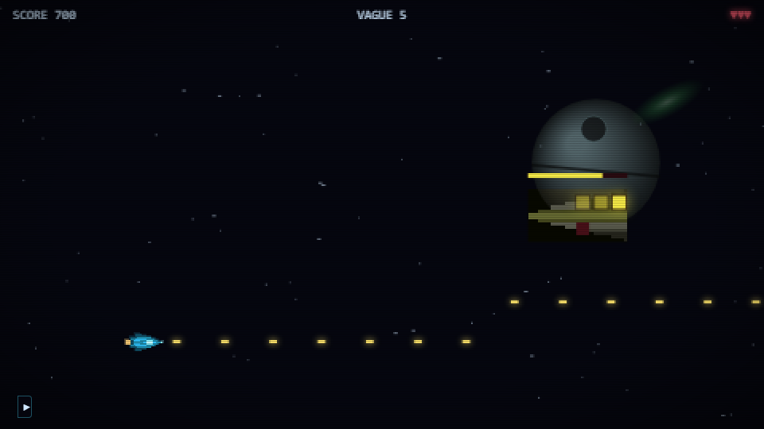
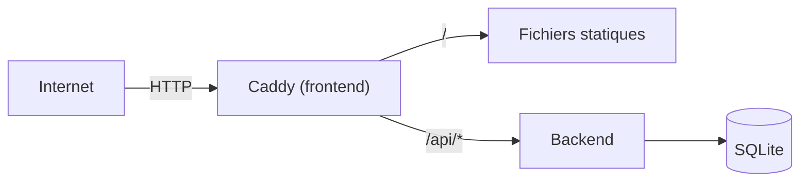

# ArcadePipe 🚀

Mini jeu vidéo (*The Last Starfighter*) avec leaderboard — shoot'em up à défilement horizontal, pixel art généré par code, jouable directement dans le navigateur. Conçu par [pazpop](https://github.com/pazpop) avec [Claude](https://claude.com).

Ce repo contient uniquement le jeu (backend + frontend) — `docker-compose.yml` (voir plus bas) suffit à le faire tourner n'importe où, sans dépendance externe. Une instance publique tourne sur **https://arcadepipe.pazpop.net**, déployée depuis un repo d'infra séparé ([`terraform-infra-pazpop-hetzner`](https://github.com/pazpop/terraform-infra-pazpop-hetzner)) — voir *CI/CD* pour le détail de cette séparation.



## 🎓 Pourquoi ce projet ?

Ce projet (et l'infra qui l'héberge, voir [`terraform-infra-pazpop-hetzner`](https://github.com/pazpop/terraform-infra-pazpop-hetzner)) est réalisé avec l'aide de [Claude](https://claude.com) (Anthropic) comme assistant technique. L'objectif n'est pas de contourner l'apprentissage, mais de l'accélérer : explorer des choix que je n'aurais pas eu le temps de creuser seul, challenger mes propres habitudes, et accélérer les tâches répétitives. Je reste le décideur à chaque étape — je teste avant de faire confiance, je demande des revues de sécurité et de qualité, et j'écarte ce qui est disproportionné pour un projet de cette taille (voir *Sécurité* et *Roadmap* ci-dessous, qui documentent aussi bien ce qui est fait que ce qui est volontairement laissé de côté, et pourquoi). L'IA ne remplace pas l'expertise, elle en démultiplie la portée.

## Stack

| Composant | Techno | Rôle |
|---|---|---|
| Backend | FastAPI + `sqlite3` natif | API du leaderboard |
| Frontend | JS vanilla (modules ES6) + Canvas 2D | Shoot'em up à défilement horizontal, pixel art généré par code |
| DB | SQLite (WAL), volume Docker | Scores |
| Musique | [libopenmpt](https://lib.openmpt.org/libopenmpt/) via [chiptune3.js](https://github.com/DrSnuggles/chiptune) (`AudioWorklet`) | Rejoue le vrai fichier `.xm` (`frontend/music/theme.xm`), pas une recomposition |



Ce diagramme correspond à `docker-compose.yml` (voir *Docker*) : Caddy sert le jeu et route lui-même `/api/*` vers le backend, sans reverse-proxy externe. L'instance publique (`arcadepipe.pazpop.net`) ajoute Traefik devant (TLS, routage par nom d'hôte entre plusieurs jeux) — géré entièrement par le repo d'infra séparé, invisible depuis ce repo-ci.

## Lancer en local

```bash
cd backend && python -m venv venv && source venv/bin/activate  # Windows: venv\Scripts\activate
pip install -r requirements.txt && python seed.py && uvicorn main:app --reload
```
```bash
cd frontend && python -m http.server 5500   # http://localhost:5500
```

## Docker

`docker-compose.yml`, à la racine, fait tourner tout le jeu (backend + frontend) sans aucune dépendance externe — publie directement le port 80 et garde toutes les protections de sécurité (non-root, rootfs read-only, `cap_drop: ALL`, rate limiting, CORS). Caddy (frontend) route lui-même `/api/*` vers le backend, pas besoin d'un reverse-proxy en plus.

```bash
docker compose up --build -d
# -> http://localhost
```

Testé de bout en bout (page d'accueil, fichiers statiques, `GET`/`POST /api/scores` via le routage interne, non-root confirmé) avant d'être documenté ici. Port 80 déjà pris ? Changer le mapping `"80:80"` du service `frontend` (ex: `"8080:80"`) et adapter `ALLOWED_ORIGINS` du service `backend` à l'URL réellement utilisée.

C'est le seul fichier de déploiement Docker de ce repo — celui qui ajoute Traefik/TLS pour l'instance `arcadepipe.pazpop.net` vit dans le repo d'infra séparé (voir *CI/CD*), pas ici.

## Tests

Voir [`backend/README.md`](backend/README.md) (pytest, lint) et [`frontend/README.md`](frontend/README.md) (`node --test`).

### Tests bout-en-bout (Playwright)

`backend`/`frontend/js` ci-dessus couvrent la logique pure, mais rien du canvas, de la souris/du tactile ni de l'audio — c'est ce que `e2e/` teste, en pilotant un vrai navigateur (Chromium) sur le jeu tel qu'un joueur le vivrait. Voir [`e2e/README.md`](e2e/README.md) pour le détail (ce qui est couvert, limites, comment forcer une constante le temps d'un test).

```bash
cd e2e && npm install && npm run install-browsers && npm test
```

## Sécurité

- CORS restreint (`ALLOWED_ORIGINS`, jamais `"*"`), requêtes SQL paramétrées, entrées validées (Pydantic)
- Nom de joueur jamais inséré dans du HTML (rendu Canvas côté client, API JSON côté serveur) — aucune surface XSS, sans échappement explicite à maintenir
- **Rate limiting** (`slowapi`, par IP réelle via `X-Forwarded-For` si un reverse-proxy de confiance le pose devant, sinon l'IP de connexion directe) : `POST /api/scores` à 5/minute, `GET /api/scores` à 60/minute (lecture bon marché mais toujours limitée, en défense en profondeur)
- Backend **et** frontend non-root, rootfs read-only, `cap_drop: ALL` (voir `docker-compose.yml` — le frontend garde `NET_BIND_SERVICE`, seule capacité nécessaire pour qu'un Caddy non-root se lie au port 80)
- **Non fait volontairement** : score non authentifié (triche possible via `curl`, juste borné à 999999) ; en-têtes de sécurité HTTP additionnels (HSTS, CSP...) laissés au reverse-proxy de qui déploie ce jeu (l'instance `arcadepipe.pazpop.net` les pose via Traefik, dans son repo d'infra séparé) plutôt qu'imposés ici

## Données collectées

- **Pseudo, score, vague** (`player_name` 1-20 caractères, `score`, `wave`) : seules données stockées, dans SQLite, sans limite de rétention.
- **Adresse IP** : lue depuis `X-Forwarded-For` uniquement pour le rate limiting (`slowapi`) — gardée en mémoire le temps de la fenêtre de 5/minute, jamais écrite en base ni dans un fichier de log applicatif.
- Aucun cookie, aucun tracker, aucun outil d'analytics.

## CI/CD

`.github/workflows/deploy.yml` : sur push vers `main`, lint (`ruff`) puis build + push des images vers GHCR (tags `:latest` et `:<sha>`, public — aucune authentification requise pour `docker pull` où que ce soit).

Ce repo s'arrête là — il ne connaît ni VPS ni serveur cible. L'instance `arcadepipe.pazpop.net` est déployée par un repo d'infra séparé ([`terraform-infra-pazpop-hetzner`](https://github.com/pazpop/terraform-infra-pazpop-hetzner)), notifié via un événement `repository_dispatch` une fois les images publiées (voir le CI/CD de ce repo-là pour le détail). Un fork ou un usage communautaire n'a pas ce déclenchement (secret absent) et n'en a pas besoin — voir *Docker* ci-dessus pour se déployer soi-même.

⚠️ GHCR crée les packages en **privé** par défaut au premier push — après le premier run, aller dans Package Settings sur GitHub et les passer en public (sinon `docker compose pull` échoue côté déploiement sans authentification).

## Roadmap

- [ ] Sauvegardes DB ([Litestream](https://litestream.io/) ou cron) — **reporté volontairement** : pas de vraie perte critique en cas d'incident pour un classement de jeu perso, pas prioritaire pour l'instant
- [ ] Score authentifié (jeton signé émis au début de la partie, exigé à la soumission) — pas urgent, le score non authentifié est un risque assumé (voir Sécurité)

## Structure

```
arcadepipe/
├── backend/    # FastAPI + SQLite + Dockerfile — voir backend/README.md
├── frontend/   # Dockerfile (Caddy = serveur de fichiers statiques) — voir frontend/README.md
│   ├── index.html, css/style.css
│   ├── js/       # config, assets (sprites générés), moteur de jeu (modules ES6)
│   │   └── audio/  # sfx.js (synthèse), music.js + leaderboard.js (intégrations)
│   ├── lib/      # chiptune3.js + libopenmpt.worklet.js (lecture de module tracker, AudioWorklet)
│   └── music/    # playlist de .xm — voir Crédits
├── e2e/        # tests bout-en-bout Playwright — voir section Tests
├── .github/workflows/  # CI/CD (lint + build + push GHCR + notification de déploiement)
└── docker-compose.yml  # seul fichier de déploiement Docker de ce repo — voir section Docker
```

## Crédits

- Musique : playlist de 5 morceaux composés pour la scène keygen par **DEViANCE** et **h4x0r** — trouvés via [keygen.music](https://keygen.music/) / [keygenmusic.tk](https://keygenmusic.tk/). Merci à ses autrices/auteurs et à la scène tracker en général. Aucune licence explicite trouvée (les dépôts qui les archivent n'en ont pas non plus) : utilisés ici sciemment pour un projet personnel non-commercial, pas au-delà.
- Lecture du fichier : [libopenmpt](https://lib.openmpt.org/libopenmpt/) (BSD-3-Clause) via [chiptune3.js](https://github.com/DrSnuggles/chiptune) (MIT) — la même techno que keygenmusic.tk utilise pour son propre lecteur.

## Licence

Code sous [MIT](LICENSE). La musique (`frontend/music/`) n'est pas couverte par cette licence — voir Crédits ci-dessus pour son statut.
