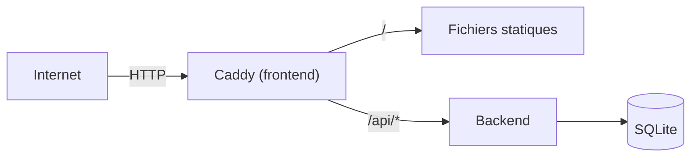

# ArcadePipe 🚀

Mini jeu vidéo (*The Last Starfighter*) avec leaderboard — shoot'em up à défilement horizontal, pixel art généré par code, jouable directement dans le navigateur. Conçu par [pazpop](https://github.com/pazpop), développé avec l'aide d'assistants IA ([Claude](https://claude.com) d'Anthropic et [Lumo](https://lumo.proton.me) de Proton) — décisions de conception et relectures finales humaines.

Ce repo contient uniquement le jeu (backend + frontend), déployable n'importe où avec `docker-compose.yml` (voir plus bas), sans dépendance externe. L'instance publique, **https://arcadepipe.pazpop.net**, est déployée séparément depuis [`terraform-infra-pazpop-hetzner`](https://github.com/pazpop/terraform-infra-pazpop-hetzner) — voir *CI/CD* pour le détail de cette séparation.


## 🎓 Pourquoi ce projet ?

Ce projet (et l'infra qui l'héberge, voir [`terraform-infra-pazpop-hetzner`](https://github.com/pazpop/terraform-infra-pazpop-hetzner)) est réalisé avec l'aide d'assistants IA — [Claude](https://claude.com) (Anthropic) et [Lumo](https://lumo.proton.me) (Proton) — comme assistants techniques. L'objectif n'est pas de contourner l'apprentissage, mais de l'accélérer : explorer des choix que je n'aurais pas eu le temps de creuser seul, challenger mes propres habitudes, et accélérer les tâches répétitives. Je reste le décideur à chaque étape — je teste avant de faire confiance, je demande des revues de sécurité et de qualité, et j'écarte ce qui est disproportionné pour un projet de cette taille (voir *Sécurité* et *Roadmap* ci-dessous, qui documentent aussi bien ce qui est fait que ce qui est volontairement laissé de côté, et pourquoi). L'IA ne remplace pas l'expertise, elle en démultiplie la portée.

**Un exemple concret** de ce que ça donne en pratique, plutôt qu'une description abstraite : Lumo a proposé de découper `states/playing.js` en sous-modules calqués sur le patron de `states/` (une symétrie séduisante avec `game.js`). Claude a relu le fichier en entier plutôt que d'acquiescer, et a contesté l'analogie avec une preuve concrète : les écrans de `states/` sont mutuellement exclusifs par construction (un seul MODE actif à la fois), alors que les sous-systèmes de `playing.js` (collisions, NOVA, vagues, boss, niveau bonus) coexistent dans la même frame — les extraire déplacerait le couplage plutôt que de le réduire. Lumo a reconnu l'argument après relecture ; la décision finale (une seule extraction retenue, `waves.js`, au lieu de la symétrie complète proposée au départ) reste la mienne, documentée dans la *Roadmap*. Une proposition d'IA challengée par une autre IA, arbitrée par l'humain avec le code comme preuve — c'est ce théâtre à trois, pas la confiance aveugle en une seule sortie de modèle, qui fait la différence.

## Stack

| Composant | Techno | Rôle |
|---|---|---|
| Backend | FastAPI + `sqlite3` natif | API du leaderboard |
| Frontend | JS vanilla (modules ES6) + Canvas 2D | Shoot'em up à défilement horizontal, pixel art généré par code |
| DB | SQLite (WAL), volume Docker | Scores |
| Musique | [libopenmpt](https://lib.openmpt.org/libopenmpt/) via [chiptune3.js](https://github.com/DrSnuggles/chiptune) (`AudioWorklet`) | Rejoue le vrai fichier `.xm` (`frontend/music/theme.xm`), pas une recomposition |



Ce diagramme correspond à `docker-compose.yml` (voir *Docker*) : Caddy sert le jeu et route lui-même `/api/*` vers le backend, sans reverse-proxy externe. L'instance publique (`arcadepipe.pazpop.net`) ajoute Traefik devant (TLS, routage par nom d'hôte entre plusieurs jeux) — géré entièrement par le repo d'infra séparé, invisible depuis ce repo-ci.

## Lancer en local

```bash
cd backend && python -m venv venv && source venv/bin/activate  # Windows: venv\Scripts\activate
pip install -r requirements.txt && python seed.py && uvicorn main:app --reload
```
```bash
cd frontend && python -m http.server 5500   # http://localhost:5500
```

## Docker

`docker-compose.yml`, à la racine, fait tourner tout le jeu (backend + frontend) sans aucune dépendance externe — publie directement le port 80 et garde toutes les protections de sécurité (non-root, rootfs read-only, `cap_drop: ALL`, rate limiting, CORS). Caddy (frontend) route lui-même `/api/*` vers le backend, pas besoin d'un reverse-proxy en plus.

```bash
docker compose up --build -d
# -> http://localhost
```

Testé de bout en bout (page d'accueil, fichiers statiques, `GET`/`POST /api/scores` via le routage interne, non-root confirmé) avant d'être documenté ici. Port 80 déjà pris ? Changer le mapping `"80:80"` du service `frontend` (ex: `"8080:80"`) et adapter `ALLOWED_ORIGINS` du service `backend` à l'URL réellement utilisée.

C'est le seul fichier de déploiement Docker de ce repo — celui qui ajoute Traefik/TLS pour l'instance `arcadepipe.pazpop.net` vit dans le repo d'infra séparé (voir *CI/CD*), pas ici.

## Tests

Voir [`backend/README.md`](backend/README.md) (pytest, lint) et [`frontend/README.md`](frontend/README.md) (`node --test`).

### Tests bout-en-bout (Playwright)

`backend`/`frontend/js` ci-dessus couvrent la logique pure, mais rien du canvas, de la souris/du tactile ni de l'audio — c'est ce que `e2e/` teste, en pilotant un vrai navigateur (Chromium) sur le jeu tel qu'un joueur le vivrait. Voir [`e2e/README.md`](e2e/README.md) pour le détail (ce qui est couvert, limites, comment forcer une constante le temps d'un test).

```bash
cd e2e && npm install && npm run install-browsers && npm test
```

## Sécurité

- CORS restreint (`ALLOWED_ORIGINS`, jamais `"*"`), requêtes SQL paramétrées, entrées validées (Pydantic)
- Nom de joueur jamais inséré dans du HTML (rendu Canvas côté client, API JSON côté serveur) — aucune surface XSS, sans échappement explicite à maintenir
- **Rate limiting** (`slowapi`, par IP réelle via `X-Forwarded-For` si un reverse-proxy de confiance le pose devant, sinon l'IP de connexion directe) : `POST /api/scores` à 5/minute, `GET /api/scores` à 60/minute (lecture bon marché mais toujours limitée, en défense en profondeur)
- Backend **et** frontend non-root, rootfs read-only, `cap_drop: ALL` (voir `docker-compose.yml` — le frontend garde `NET_BIND_SERVICE`, seule capacité nécessaire pour qu'un Caddy non-root se lie au port 80)
- Taille des requêtes `POST /api/*` plafonnée par le reverse-proxy (10 Ko, largement suffisant pour un score) — sans ça, un payload énorme serait lu en mémoire avant même que Pydantic ne le rejette. Scopé aux routes API uniquement (jamais aux fichiers statiques/musique, servis par un routeur séparé) pour ne jamais risquer de casser un téléchargement légitime
- Sauvegarde quotidienne de la base SQLite (timer systemd sur la VPS, testée en conditions réelles — backup/restauration validées) — gérée entièrement dans le repo d'infra séparé (`terraform-infra-pazpop-hetzner/backup/`), pas ici
- **Non fait volontairement** : score non authentifié (triche possible via `curl`, juste borné à 999999) ; en-têtes de sécurité HTTP additionnels (HSTS, CSP...) laissés au reverse-proxy de qui déploie ce jeu (l'instance `arcadepipe.pazpop.net` les pose via Traefik, dans son repo d'infra séparé) plutôt qu'imposés ici ; `player_name` borné à 20 *codepoints* Unicode (pas 20 caractères visuels — des combinants pourraient en théorie produire un rendu "zalgo") : sans impact sécurité (rendu Canvas2D, pas de HTML), et l'interface du jeu filtre de toute façon la saisie à `[A-Z0-9 ]` — seul un appel direct à l'API en dehors du jeu pourrait le voir

## Données collectées

- **Pseudo, score, vague** (`player_name` 1-20 caractères, `score`, `wave`) : seules données stockées, dans SQLite, sans limite de rétention.
- **Adresse IP** : lue depuis `X-Forwarded-For` uniquement pour le rate limiting (`slowapi`) — gardée en mémoire le temps de la fenêtre de 5/minute, jamais écrite en base ni dans un fichier de log applicatif.
- Aucun cookie, aucun tracker, aucun outil d'analytics.

## CI/CD

`.github/workflows/deploy.yml` : sur push vers `main`, lint backend (`ruff`) + audit des dépendances (`pip-audit`, contre les CVE connues) + lint frontend (`eslint`) puis build + push des images vers GHCR (tags `:latest` et `:<sha>`, public — aucune authentification requise pour `docker pull` où que ce soit).

- Actions GitHub épinglées par SHA de commit (pas par tag `vX`) : un tag peut être redéplacé vers un autre commit sans que rien ne change ici — le SHA est immuable.
- Images de base (`python:3.11-slim`, `caddy:2-alpine`) épinglées par digest dans les Dockerfiles, pour la même raison.
- [Dependabot](.github/dependabot.yml) ouvre une PR à chaque mise à jour disponible (`pip`, `github-actions`, `docker`) — aucune veille manuelle nécessaire malgré les pins par SHA/digest.

Ce repo s'arrête là — il ne connaît ni VPS ni serveur cible. L'instance `arcadepipe.pazpop.net` est déployée par un repo d'infra séparé ([`terraform-infra-pazpop-hetzner`](https://github.com/pazpop/terraform-infra-pazpop-hetzner)), notifié via un événement `repository_dispatch` une fois les images publiées (voir le CI/CD de ce repo-là pour le détail). Un fork ou un usage communautaire n'a pas ce déclenchement (secret absent) et n'en a pas besoin — voir *Docker* ci-dessus pour se déployer soi-même.

⚠️ GHCR crée les packages en **privé** par défaut au premier push — après le premier run, aller dans Package Settings sur GitHub et les passer en public (sinon `docker compose pull` échoue côté déploiement sans authentification).

## Roadmap

Organisée par session de travail suggérée (issue d'une discussion Lumo/Claude/arbitrage humain le 2026-09-18) plutôt qu'en vrac — chaque session est indépendante, à reprendre quand il y a du temps dédié.

### Session 1 — stabilisation (architecture `states/playing.js`)

Issu d'une discussion à trois (utilisateur, Claude, revue croisée) sur la décomposition de `game.js` : contrairement aux écrans de `states/` (mutuellement exclusifs par construction, un seul MODE actif à la fois), les sous-systèmes de `playing.js` (collisions, NOVA, vagues, boss, niveau bonus) coexistent dans la même frame — les extraire en modules séparés déplacerait le couplage plutôt que de le réduire. Seule extraction retenue, grain jugé correct : un `waves.js` (le bloc `startWave` + la logique `waveBreak`/déclenchement du niveau bonus dans `update()`), même patron que `bonusLevel.js` (minuteur propre, champs `g` propres).

- [ ] Extraire `waves.js` de `states/playing.js`.
- [ ] Fix : la clause de garde de `updateGraze()` (`graze.js`) ne vérifie pas `g.bonusLevel`/`g.clearingScreen`, contrairement à `resolveCollisions()` qui le fait — actuellement protégé seulement par une coïncidence de données (pools ennemis/tirs vides pendant le niveau bonus), pas par le code. Ajouter `|| g.clearingScreen` à la garde.
- [ ] Ajouter un test dans `frontend/js/graze.test.js` qui fige cette règle ("le graze ne progresse pas pendant clearingScreen") — sans ça la garde peut redivergir au prochain ajout, protégée à nouveau par une coïncidence jusqu'à ce que non.
- [ ] Commentaire de cartographie "qui écrit quoi" sur les champs `g` liés à NOVA (`novaStock`/`novaProgress`) — 3 écrivains identifiés : `graze.js` (incrément), `states/playing.js` `tryUseNova`/`triggerNova` (décrément manuel), `states/playing.js` `applyNovaReward` (paiement du niveau bonus, une fois).
- [ ] Commentaire explicite en tête de `drawScene()` (`states/playing.js`) formulant l'invariant qui rend le freeze pendant PAUSED/GAME_OVER correct : aucune fonction `draw*` ne doit lire `performance.now()`/`Date.now()` directement, seulement de l'état posé par `update()` (lui-même conditionné au mode) — vérifié vrai aujourd'hui (grep sur tout `frontend/js`), mais implicite, donc fragile à un futur ajout.
- [ ] Option pour plus tard, si l'invariant ci-dessus doit être renforcé au-delà d'un commentaire : un test e2e comparant deux captures d'écran prises en pause (doivent être bit à bit identiques) — meilleur rapport effort/protection qu'une règle ESLint personnalisée interdisant `performance.now`/`Date.now` dans les fonctions `draw*` (techniquement possible mais coûteuse à écrire proprement).

### Session 2 — nouvelles fonctionnalités (meilleur rapport effort/impact)

- [ ] **Distance parcourue, phase 1 (frontend seul)** — priorité la plus haute de la Roadmap actuelle : aucun changement backend requis (`g.distanceTraveled += vitesse × warp × dt` dans `states/playing.js`), affichage immédiat à l'écran de fin de partie et sur la carte de partage. Risque quasi nul (pas de DB, pas de logique de scoring touchée). Coche progressivement l'idée déjà notée dans `frontend/GAMEPLAY.md` (classement = phase 2, plus tard, demande un changement de schéma serveur).
- [ ] **QR code sur la carte de partage** (`shareCard.js`) — 100% client-side (contrairement au "lien court" écarté plus tôt, un QR code encode directement l'URL statique du jeu, pas besoin de backend). Ajouter une petite bibliothèque de génération QR vendorisée dans `lib/` (même principe que `chiptune3.js` déjà dans le repo — un seul fichier, sans dépendance), appelée lors de la génération de la carte. Utile surtout sur mobile, où scanner bat le recopiage manuel de l'URL.

### Session 3 — optimisations optionnelles (pas pressé)

- [ ] **Rang dynamique** (monte par tranche de X grazes sans dégât, redescend au coup encaissé, module vitesse des tirs/taux de spawn) — le code est simple (un `g.rank` + compteur, un multiplicateur lu par `bulletSpeedFactor`/le spawn d'ennemis/les intervalles de tir du boss), **le vrai coût est le tuning** : X grazes par palier, combien on perd par coup, ajuster jusqu'à ce que la pression soit juste — ça ne se devine pas, ça se joue et se réajuste. À lancer seulement quand le jeu est stable et qu'il y a du temps dédié au réglage, pas avant.
- [ ] **Cache session du classement** (`states/leaderboardScreen.js`) : chaque ouverture de l'écran classement refait `fetchTopScores(10)` **et** `fetchGamesPlayedCount()`, sans mémorisation — 5 ouvertures/fermetures = 10 requêtes. Payloads minuscules et rate-limiting déjà en place côté backend, donc gain estimé <10ms par session ; pas prioritaire, à faire seulement si un joueur signale une vraie lenteur (data-driven, pas préemptif). Si implémenté : un cache avec TTL court, **contrainte explicite — doit s'invalider après une soumission de score** (`confirmNameEntry` rouvre le classement juste après avoir soumis, `g.scores` doit rester frais à ce moment précis, jamais servir une version en cache à cet instant-là).
- [ ] **Événement mi-run** (un mini-événement imprévu qui casse la courbe monotone vagues/boss/bonus une fois par run — ex: formation ennemie spéciale en anneau) — en réserve, pas pressé. Avant tout un design challenge (déclenché par quoi : vague fixe, score, temps écoulé ? les runs varient trop en durée pour un simple "milieu de partie") plutôt qu'un chantier de code : le niveau bonus fournit déjà l'échafaudage réutilisable (seuil de déclenchement, glissée d'entrée, message explicatif, garde anti-doublon), donc moins cher que ça en a l'air une fois la décision de design prise.

### Autres (non séquencées)

- [ ] Score authentifié (jeton signé émis au début de la partie, exigé à la soumission) — pas urgent, le score non authentifié est un risque assumé (voir Sécurité)
- [ ] Scan de vulnérabilités des **images construites** ([Trivy](https://trivy.dev/), en CI juste après le build) — `pip-audit` couvre les dépendances Python déclarées, mais pas les paquets système de l'image finale (ex: libs Debian de `python:3.11-slim`)

## Structure

```
arcadepipe/
├── backend/    # FastAPI + SQLite + Dockerfile — voir backend/README.md
├── frontend/   # Dockerfile (Caddy = serveur de fichiers statiques) — voir frontend/README.md, et frontend/GAMEPLAY.md pour le détail du gameplay implémenté
│   ├── index.html, css/style.css
│   ├── js/       # config, assets (sprites générés), moteur de jeu (modules ES6)
│   │   └── audio/  # sfx.js (synthèse), music.js + leaderboard.js (intégrations)
│   ├── lib/      # chiptune3.js + libopenmpt.worklet.js (lecture de module tracker, AudioWorklet)
│   └── music/    # playlist de .xm — voir Crédits
├── e2e/        # tests bout-en-bout Playwright — voir section Tests
├── .github/workflows/  # CI/CD (lint + build + push GHCR + notification de déploiement)
├── docker-compose.yml  # seul fichier de déploiement Docker de ce repo — voir section Docker
└── CHANGELOG.md  # changements notables, une entrée par version qui le mérite
```

## Crédits

- Musique : playlist de 5 morceaux composés pour la scène keygen par **DEViANCE** et **h4x0r** — trouvés via [keygen.music](https://keygen.music/) / [keygenmusic.tk](https://keygenmusic.tk/). Merci à ses autrices/auteurs et à la scène tracker en général. Aucune licence explicite trouvée (les dépôts qui les archivent n'en ont pas non plus) : utilisés ici sciemment pour un projet personnel non-commercial, pas au-delà.
- Lecture du fichier : [libopenmpt](https://lib.openmpt.org/libopenmpt/) (BSD-3-Clause) via [chiptune3.js](https://github.com/DrSnuggles/chiptune) (MIT) — la même techno que keygenmusic.tk utilise pour son propre lecteur.

## Licence

Code sous [MIT](LICENSE). La musique (`frontend/music/`) n'est pas couverte par cette licence — voir Crédits ci-dessus pour son statut.
