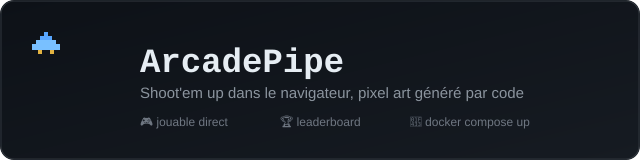
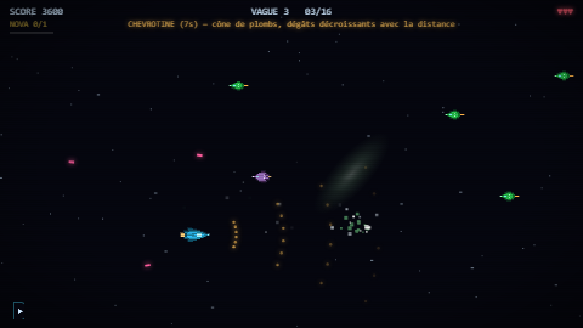

# ArcadePipe 🚀

Shoot'em up spatial rétro (*The Last Starfighter*) jouable dans le navigateur : pixel art généré par code, musique originale de [mall-e](https://mall-e.bandcamp.com/), classement en ligne. Conçu par [pazpop](https://github.com/pazpop).

▶ **Jouer : https://arcadepipe.pazpop.net**



## Lancer en local

Il faut Python 3.13 (backend, et serveur de fichiers du frontend). Node 20 ou plus récent n'est nécessaire que pour les tests et le lint.

```bash
cd backend && python -m venv venv && source venv/bin/activate  # Windows : venv\Scripts\activate
pip install -r requirements.txt && python seed.py && uvicorn main:app --reload
```
```bash
cd frontend && python -m http.server 5500   # http://localhost:5500
```

Tout-en-un avec Docker : `docker compose up --build -d`, puis http://localhost.

## Stack

JS vanilla (modules ES6) + Canvas 2D, sans build · FastAPI + SQLite · musique MP3 (Web Audio) · Docker Compose · CI GitHub Actions. L'instance publique est déployée depuis [`terraform-infra-pazpop-hetzner`](https://github.com/pazpop/terraform-infra-pazpop-hetzner).

## Aller plus loin

- **Traduire le jeu** : copier [`frontend/js/i18n/fr.js`](frontend/js/i18n/fr.js) (la référence) sous le code de la langue (`es.js`...), traduire les textes en gardant les `{paramètres}` tels quels, puis l'ajouter à `LANGS` dans [`frontend/js/i18n.js`](frontend/js/i18n.js) et dessiner son drapeau (`.flag-es`, [`frontend/css/style.css`](frontend/css/style.css)). `node --test` (dans `frontend/js`) signale toute clé manquante.
- **Code** : [architecture du frontend](frontend/README.md) · [règles du jeu](frontend/GAMEPLAY.md) · [backend](backend/README.md) · [tests e2e](e2e/README.md)
- **Exploitation** : [déploiement](docs/deploiement.md) · [sécurité](docs/securite.md) · [données collectées](docs/donnees-collectees.md)
- **Suivi** : [changelog](CHANGELOG.md) · [roadmap](ROADMAP.md)

## 🎓 Pourquoi ce projet ?

Réalisé avec l'aide d'assistants IA ([Claude](https://claude.com), [Lumo](https://lumo.proton.me)) pour explorer et accélérer, pas pour décider : je teste avant de faire confiance et je reste le décideur à chaque étape.

## Crédits et licence

- Musique : 4 morceaux de **[mall-e](https://mall-e.bandcamp.com/)**. Un grand merci à lui !
- QR code : [qrcode-generator](https://github.com/kazuhikoarase/qrcode-generator) (MIT).
- Code sous [MIT](LICENSE). La musique (`frontend/music/`) appartient à mall-e et n'est pas couverte par cette licence.
