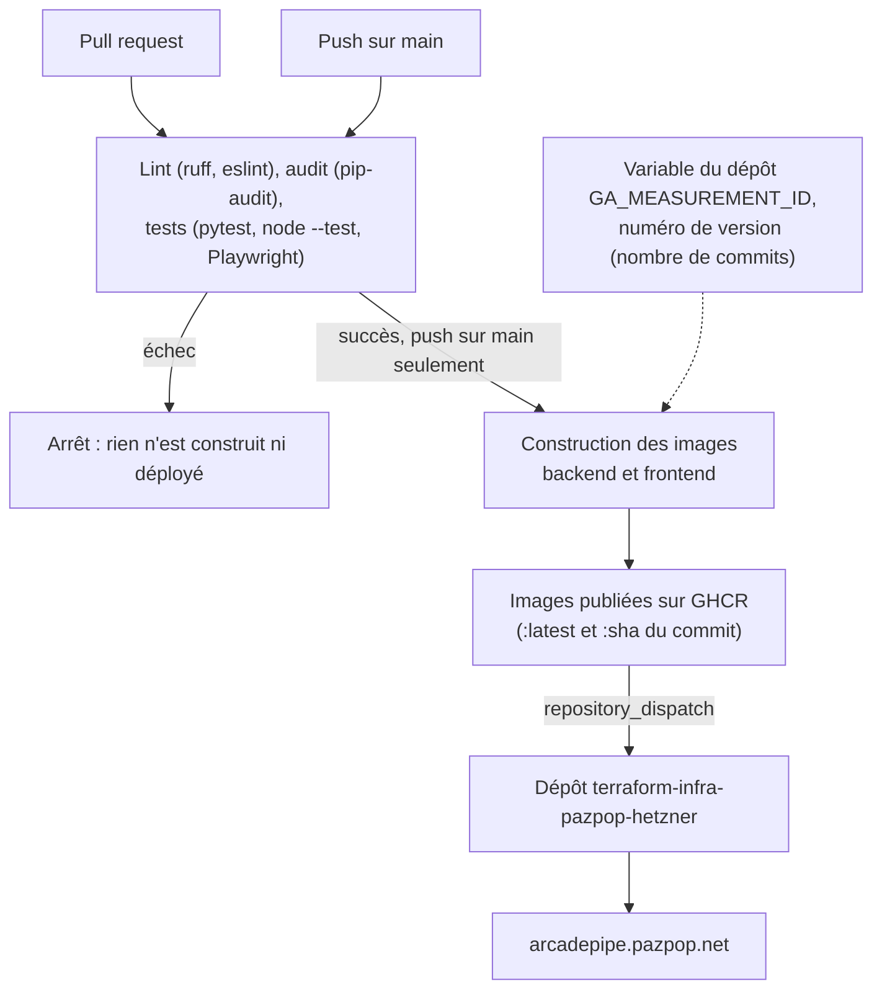

# Déploiement

## Docker (autonome)

`docker-compose.yml`, à la racine, est le seul fichier de déploiement Docker de ce repo (celui qui ajoute Traefik et TLS pour l'instance publique vit dans le repo d'infra). Il fait tourner tout le jeu (backend + frontend) sans dépendance externe, publie le port 80 et garde les protections de sécurité (non-root, rootfs read-only, `cap_drop: ALL`, rate limiting, CORS). Caddy (frontend) route lui-même `/api/*` vers le backend.

```bash
docker compose up --build -d
# -> http://localhost
```

Port 80 déjà pris ? Changer le mapping `"80:80"` du service `frontend` (ex. `"8080:80"`).

### Mesure d'audience (désactivée par défaut)

Le jeu peut charger Google Analytics, mais aucun identifiant n'est écrit dans le code : sans réglage, il n'y a ni script, ni cookie, ni bandeau de consentement. L'identifiant de mesure (`G-XXXXXXXXXX`) est donné à la construction de l'image du frontend, qui l'écrit dans `site-config.json`, lu par le jeu au chargement (`js/siteConfig.js`). Le script n'est chargé qu'après un « Accepter » du visiteur.

- **Instance publique** : variable `GA_MEASUREMENT_ID` du dépôt GitHub (*Settings > Secrets and variables > Actions > Variables*), passée à la construction par `.github/workflows/deploy.yml`. Pour désactiver la mesure, supprimer la variable : la prochaine image sera construite sans. Un fork n'a pas cette variable, donc pas de mesure.
- **Docker autonome** : `docker compose build --build-arg GA_MEASUREMENT_ID=G-XXXXXXXXXX frontend`, puis `docker compose up -d`.
- **Hors Docker** (`python -m http.server`) : c'est le fichier `frontend/site-config.json` qui est servi ; y mettre l'identifiant pour un essai, sans le commiter.

Le reverse-proxy doit autoriser `googletagmanager.com` et `google-analytics.com` dans sa CSP.

## itch.io

itch.io héberge les fichiers du jeu chez lui ; le classement, lui, reste sur le site. `python tools/build_itch.py` construit `dist/arcadepipe-itch.zip` : les fichiers du jeu, avec l'adresse complète de l'API dans `site-config.json` (`apiBase`) et le numéro de version. Il n'y a pas de mesure d'audience dans cette archive.

1. Sur itch.io, créer un projet de type *HTML*, y déposer l'archive et cocher *This file will be played in the browser*.
2. Dimensions de l'affichage : 960 × 540 (le jeu est en 16:9), avec le bouton plein écran.
3. Autoriser l'adresse d'itch.io à appeler l'API : ajouter son origine, `https://html-classic.itch.zone`, à `ALLOWED_ORIGINS` du backend, à côté de celle du site (variable d'environnement du service `backend` : clé `environment:` dans `docker-compose.yml`). Sans cela, le jeu fonctionne mais affiche « Classement indisponible » et n'enregistre aucun score. Cette origine est commune à tous les jeux d'itch.io : voir [sécurité](securite.md).

## CI/CD



Tout est dans `.github/workflows/deploy.yml`. Une pull request (celles de Dependabot comprises) s'arrête après les vérifications : seul un push sur `main` construit et déploie.

- Actions GitHub épinglées par SHA de commit, images de base épinglées par digest : un tag peut être redéplacé, un SHA ou un digest non.
- [Dependabot](../.github/dependabot.yml) ouvre une PR à chaque mise à jour (`pip`, `npm`, `github-actions`, `docker`).
- `.github/workflows/audit.yml` relance l'audit des dépendances (`pip-audit`, `npm audit`) chaque lundi : une faille publiée entre deux pushs fait échouer ce workflow, et GitHub prévient par courriel.

Ce repo ne connaît ni VPS ni serveur cible. L'instance `arcadepipe.pazpop.net` est déployée par [`terraform-infra-pazpop-hetzner`](https://github.com/pazpop/terraform-infra-pazpop-hetzner), notifié par un événement `repository_dispatch` une fois les images publiées. Un fork n'a pas ce déclenchement (l'étape ne s'exécute que dans ce dépôt) et n'en a pas besoin : voir la section Docker ci-dessus.

⚠️ GHCR crée les packages en **privé** au premier push : après le premier run, les passer en public dans *Package Settings*, sinon le déploiement du repo d'infra ne peut pas les télécharger sans authentification.
