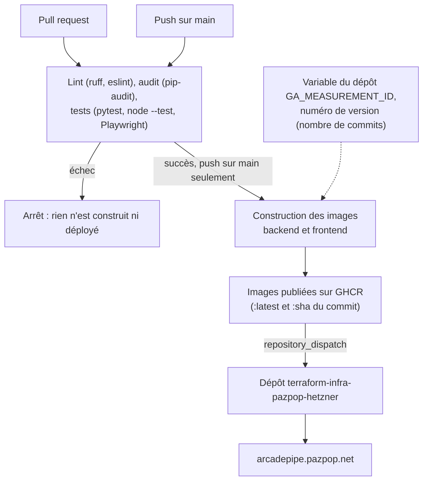

# Déploiement

## Docker (autonome)

`docker-compose.yml`, à la racine, fait tourner tout le jeu (backend + frontend) sans dépendance externe : il publie le port 80 et garde les protections de sécurité (non-root, rootfs read-only, `cap_drop: ALL`, rate limiting, CORS). Caddy (frontend) route lui-même `/api/*` vers le backend.

```bash
docker compose up --build -d
# -> http://localhost
```

Port 80 déjà pris ? Changer le mapping `"80:80"` du service `frontend` (ex. `"8080:80"`).

### Mesure d'audience (désactivée par défaut)

Le jeu peut charger Google Analytics, mais aucun identifiant n'est écrit dans le code : sans réglage, il n'y a ni script, ni cookie, ni bandeau de consentement. L'identifiant de mesure (`G-XXXXXXXXXX`) est donné à la construction de l'image du frontend, qui l'écrit dans `site-config.json`, lu par le jeu au chargement (`js/consent.js`). Le script n'est chargé qu'après un « Accepter » du visiteur.

- **Instance publique** : variable `GA_MEASUREMENT_ID` du dépôt GitHub (*Settings > Secrets and variables > Actions > Variables*), passée à la construction par `.github/workflows/deploy.yml`. Pour désactiver la mesure, supprimer la variable : la prochaine image sera construite sans. Un fork n'a pas cette variable, donc pas de mesure.
- **Docker autonome** : `docker compose build --build-arg GA_MEASUREMENT_ID=G-XXXXXXXXXX frontend`, puis `docker compose up -d`.
- **Hors Docker** (`python -m http.server`) : c'est le fichier `frontend/site-config.json` qui est servi ; y mettre l'identifiant pour un essai, sans le commiter.

Le reverse-proxy doit autoriser `googletagmanager.com` et `google-analytics.com` dans sa CSP.

C'est le seul fichier de déploiement Docker de ce repo. Celui qui ajoute Traefik et TLS pour l'instance publique vit dans le repo d'infra séparé.

## CI/CD



Une pull request s'arrête après les vérifications : seul un push sur `main` construit et déploie.

`.github/workflows/deploy.yml` : sur chaque PR et chaque push vers `main`, lint backend (`ruff`), audit des dépendances (`pip-audit`), lint frontend (`eslint`), tests backend (`pytest`), frontend (`node --test`) et bout-en-bout (Playwright), puis, sur `main` seulement, build et push des images vers GHCR (`:latest` et `:<sha>`, public). Les PR de Dependabot sont donc testées avant fusion.

- Actions GitHub épinglées par SHA de commit, images de base épinglées par digest : un tag peut être redéplacé, un SHA ou un digest non.
- [Dependabot](../.github/dependabot.yml) ouvre une PR à chaque mise à jour (`pip`, `npm`, `github-actions`, `docker`).
- Un test en échec bloque le build, donc le déploiement.

Ce repo ne connaît ni VPS ni serveur cible. L'instance `arcadepipe.pazpop.net` est déployée par [`terraform-infra-pazpop-hetzner`](https://github.com/pazpop/terraform-infra-pazpop-hetzner), notifié par un événement `repository_dispatch` une fois les images publiées. Un fork n'a pas ce déclenchement (secret absent) et n'en a pas besoin : voir la section Docker ci-dessus.

⚠️ GHCR crée les packages en **privé** au premier push : après le premier run, les passer en public dans *Package Settings*, sinon le déploiement du repo d'infra ne peut pas les télécharger sans authentification.
