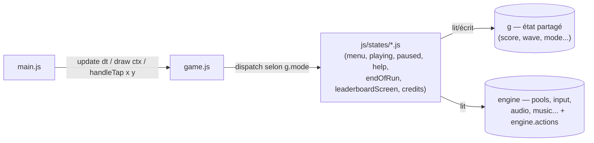

# Frontend

JS vanilla (modules ES6) + Canvas 2D — shoot'em up à défilement horizontal, pixel art généré par code.

Ce que le jeu implémente, système par système : [`GAMEPLAY.md`](GAMEPLAY.md).

## Architecture

Le jeu est une machine à états : à tout instant, `g.mode` vaut `"menu"`, `"playing"`, `"paused"`, `"help"`, `"game_over"`, `"name_entry"`, `"leaderboard"` ou `"credits"` (voir `js/states/mode.js`). `js/game.js` ne connaît plus la logique de chaque écran — il se contente de regarder `g.mode` et d'appeler le bon module de `js/states/` :



Deux objets circulent entre `game.js` et les modules de `states/`, créés une seule fois par `createGame()` :

- **`g`** : l'état de la partie (score, vague, mode courant, jauge NOVA...). Un seul objet plat, pas un sous-objet par écran — `hud.js` et les autres systèmes lisent ses champs directement, et restructurer `g` aurait touché tout le code pour un gain surtout cosmétique.
- **`engine`** : ce dont un écran a besoin sans avoir à le recréer (`input`, `audio`, `music`, les pools de joueur/ennemis/projectiles...), plus `engine.actions` — des rappels (`startRun`, `goToLeaderboard`) pour qu'un écran puisse déclencher la transition vers un autre sans créer d'import circulaire entre modules de `states/`.

Chaque module de `states/` exporte les mêmes formes de fonctions :

| Export | Rôle |
| --- | --- |
| `update(g, engine, dt)` | fait avancer la logique de l'écran d'une frame |
| `draw(c2d, g[, engine])` | dessine l'écran |
| `handleTap(g, engine, x, y)` | gère un tap/clic tactile (quand l'écran en a besoin) |

`js/states/playing.js` est à part : c'est le plus gros (vagues, collisions, boss, niveau bonus, NOVA), et sa fonction `drawScene()` est aussi appelée pour les écrans `paused` et `game_over`, qui affichent la scène de jeu figée derrière leur propre overlay plutôt qu'un fond vide.

## Lancer en local

```bash
python -m http.server 5500   # http://localhost:5500
```

## Tests

Logique pure des modules JS, aucune dépendance npm (Node ≥ 18) :

```bash
cd js && node --test   # 16 tests
```

Rien du canvas, de la souris/du tactile ni de l'audio n'est couvert ici — voir [`../e2e/README.md`](../e2e/README.md) pour les tests bout-en-bout (Playwright) qui pilotent un vrai navigateur.

## Lint

Config minimale (`eslint:recommended`, voir `eslint.config.js`) — vérifiée en CI avant chaque build (voir *CI/CD* dans le README racine), symétrique de `ruff` côté backend. `package.json` ici ne sert qu'à ça : le jeu lui-même reste du JS vanilla servi tel quel, aucune dépendance d'exécution.

```bash
npm install && npm run lint
```
