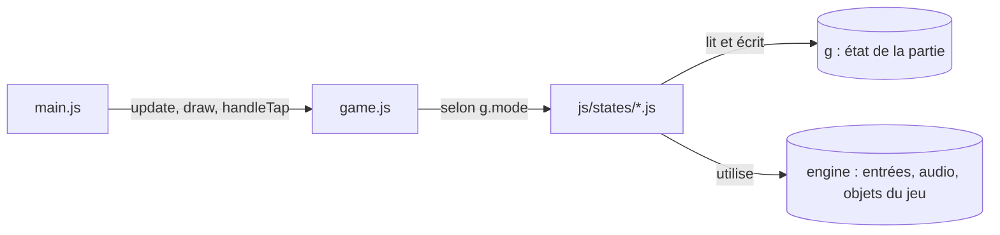

# Frontend

JS vanilla (modules ES6) + Canvas 2D, sans étape de build : les fichiers sont servis tels quels. Les règles du jeu sont dans [`GAMEPLAY.md`](GAMEPLAY.md).

## Par où commencer

| Fichier | Rôle |
| --- | --- |
| `index.html`, `css/style.css` | la page : le canvas, le panneau de réglages, les boutons posés par-dessus |
| `og-image.png` | image affichée quand un lien vers le jeu est partagé |
| `privacy.html`, `press/` | page de confidentialité et kit presse, en français et en anglais (captures refaites par `npm run presskit`, dans `e2e/`) ; `press/descriptions.html` garde les textes des pages itch.io et YouTube, à copier |
| `js/main.js` | point d'entrée : crée le jeu, branche boutons et touches, lance la boucle |
| `js/game.js` | machine à états : appelle l'écran courant de `js/states/` |
| `js/config.js` | toutes les constantes (couleurs, difficulté, bonus, boss...) |
| `js/states/` | un fichier par écran ; `playing.js` est la partie elle-même, `waves.js` l'enchaînement des vagues |
| `js/player.js`, `enemies.js`, `boss.js`, `projectiles.js`, `powerups.js`, `particles.js` | les objets du jeu : création, mise à jour, dessin |
| `js/graze.js`, `bonusLevel.js`, `collisions.js`, `patterns.js` | frôlement et NOVA, niveau bonus, collisions, formes de tirs ennemis |
| `js/hud.js` | tout le texte dessiné dans le canvas (HUD, menus, aide, classement) |
| `js/assets.js`, `stars.js` | sprites dessinés par le code, décor étoilé |
| `js/audio/` | bruitages synthétisés (`sfx.js`) et lecteur de musique (`music.js`) |
| `js/i18n.js`, `js/i18n/` | traductions, un fichier par langue |
| `js/api.js`, `consent.js`, `analytics.js`, `shareCard.js` | classement en ligne, mesure d'audience et consentement, image de partage |
| `js/siteConfig.js`, `site-config.json` | réglages du déploiement : identifiant de mesure d'audience, adresse de l'API (vides par défaut) |
| `js/renderer.js`, `input.js`, `storage.js` | canvas à la résolution de l'écran, entrées clavier/souris/tactile, préférences |
| `js/pool.js`, `color.js`, `states/navHelpers.js` | petites fonctions partagées |
| `lib/qrcode.js` | bibliothèque tierce (QR code), copiée telle quelle : à ne pas modifier |

## Architecture

Le jeu est une machine à états : à tout instant, `g.mode` désigne l'écran affiché (`"menu"`, `"playing"`, `"paused"`... voir `js/states/mode.js`). À chaque image, `js/game.js` regarde `g.mode` et appelle le module correspondant de `js/states/`.


```mermaid
flowchart LR
    main[main.js] -->|update, draw, handleTap| game[game.js]
    game -->|selon g.mode| states["js/states/*.js"]
    states -->|lit et écrit| g[("g : état de la partie")]
    states -->|utilise| engine[("engine : entrées, audio, objets du jeu")]
```

Deux objets, créés une fois par `createGame()`, circulent partout :

- **`g`** : l'état du jeu (écran courant, score, vague, jauge NOVA...), dans un seul objet.
- **`engine`** : ce dont un écran a besoin (`input`, `audio`, `music`, le joueur, les ennemis, les projectiles...), plus `engine.actions.startRun`, qui lance une partie sans import circulaire.

Un écran expose en général trois fonctions : `update` (fait avancer l'écran d'une image), `draw` (le dessine) et `handleTap` (traite un clic ou un tap), plus `open` quand il a quelque chose à préparer en s'ouvrant. `endOfRun.js` regroupe deux écrans (game over et saisie du pseudo) et nomme donc ses fonctions `updateGameOver`, `drawNameEntry`, etc.

Tout le jeu dessine en coordonnées logiques 480×270 (`RES_W`, `RES_H`) ; `renderer.js` les convertit à la taille réelle de l'écran.

## Lancer en local

Les commandes sont dans le [README principal](../README.md#lancer-en-local). Le classement n'apparaît que si le [backend](../backend/README.md) tourne aussi, et seulement à cette adresse exacte (`localhost`, port 5500).

## Tests et lint

Node 22 ou plus récent. Chaque commande part de la racine du dépôt :

```bash
cd frontend/js && node --test                # logique pure : collisions, frôlement, bonus, ennemis, boss, tirs courbes, traductions, cache de l'API
cd frontend && npm install && npm run lint   # ESLint
python tools/check_unused.py                 # code fantôme : exports, textes, ids et styles inutilisés
```

Le canvas, les entrées et l'audio sont couverts par les [tests bout-en-bout](../e2e/README.md).
